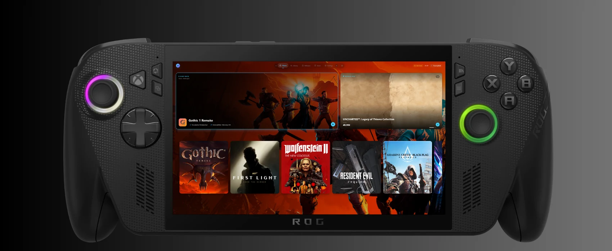
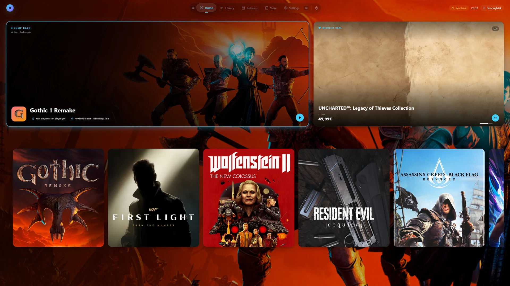
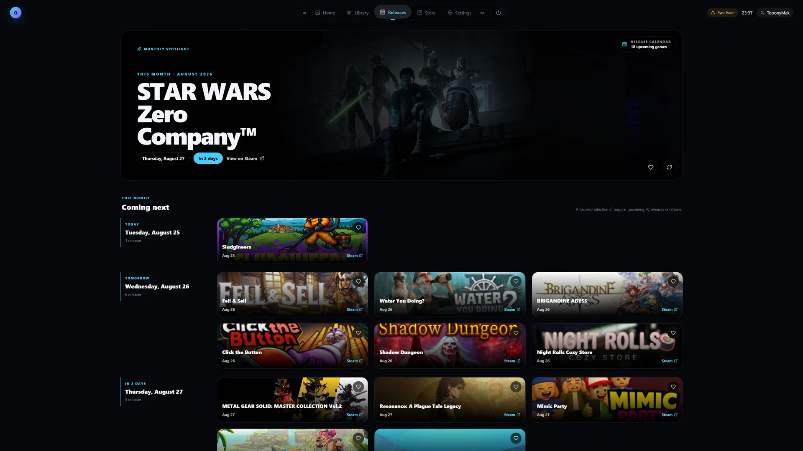

<p align="center">
  
</p>

<h1 align="center">ORBIT</h1>

<p align="center">
  A controller-first gaming launcher that brings your PC library together in one console-style home.
</p>

<p align="center">
  <a href="https://github.com/toonymak1993/orbit/releases/latest"></a>
  
  
</p>

## One home for your games

ORBIT is an Electron-based Windows launcher designed for handhelds, TVs and desktop PCs. It combines a focused game library with a living home screen, store offers and upcoming releases — all built around controller and keyboard navigation.

- Steam, Epic Games, Xbox / Microsoft Store and custom local games
- Console-style spatial navigation with visible focus and gamepad support
- Three Home layouts, including CoreSense recommendations and optional 3D card depth
- Live Steam, Epic Games and Xbox download/update activity
- Release calendar, wishlist offers and regional store prices
- Update badges for pending Steam game updates
- Session history, activity summaries and second-accurate local playtime
- Custom covers/backgrounds, profile avatars, local save backups, notifications and themes
- Safe per-game launch options and adaptive Xbox/PlayStation controller hints
- Read-only Windows Update and graphics-driver checks
- Optional Xbox Mode and background Hardware Control

## A closer look





## Download

ORBIT `0.1.0` is the first stable release. Download **`ORBIT-XboxMode-Setup-0.1.0-x64.exe`** from the [latest GitHub Release](https://github.com/toonymak1993/orbit/releases/latest). This is the only file required: the setup contains ORBIT, the signed Xbox Mode AppX, the public ORBIT certificate and the verified installation flow.

Run the setup from the Windows account that should own ORBIT and approve the administrator prompt. After installation, Windows opens **Settings > Gaming > Xbox mode** so ORBIT can be selected as the home app.

> ORBIT currently uses a self-signed `CN=ORBIT Development` certificate. Windows can therefore show an unknown-publisher or SmartScreen warning. The setup trusts only the embedded public certificate in `LocalMachine\TrustedPeople`; it never installs a private key or adds the certificate to a Root store. Verify the SHA-256 hash and certificate thumbprint published in the release notes before installing.

### Requirements

- Windows 11 x64
- A controller is recommended, but keyboard and mouse are supported
- Xbox Mode requires Windows 11 24H2 or newer

Xbox Mode visibility still depends on Microsoft's supported markets, device policy and phased Windows rollout. Keep Windows, the Xbox app and Game Bar current.

## What's new in 0.1.0

- A redesigned CoreSense Home with recent activity, personalized game context, related store titles and richer card presentation
- Live Steam, Epic Games and Xbox download progress in the launcher
- Session summaries, 7/30-day activity history and more accurate playtime tracking
- Preset, Steam and custom profile avatars plus separate cover and background artwork overrides
- Controller-friendly launch options for safe per-game arguments and adaptive Xbox/PlayStation button hints
- Read-only Windows and graphics-driver update checks from Hardware Control
- More resilient partial Steam synchronization, manifest parsing and Xbox package identity detection

## Build from source

```powershell
git clone https://github.com/toonymak1993/orbit.git
cd orbit
npm ci
npm run typecheck
npm run verify:steam
npm run verify:downloads
npm run verify:launch-arguments
npm run dev
```

Create a production build with `npm run build`. Windows installer and Xbox Mode packaging details are documented in [PACKAGING.md](PACKAGING.md).

## Project status

ORBIT `0.1.0` is the first stable public release. Integrations and packaging will continue to evolve as the launcher is tested across more PCs, handhelds and game libraries.

ORBIT is an independent project and is not affiliated with Valve, Epic Games, Microsoft, Xbox or the publishers shown in screenshots.
